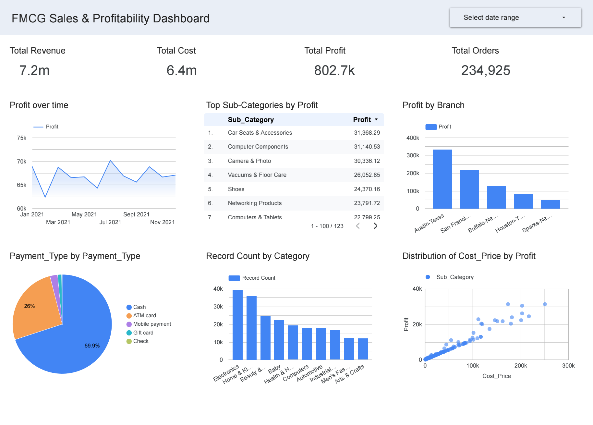

# FMCG Sales & Profitability Dashboard 🛒📊

## 📌 Project Overview
This project focuses on analyzing the sales performance and profitability of an FMCG (Fast-Moving Consumer Goods) business. The goal is to provide decision-makers with actionable insights regarding revenue trends, top-performing product categories, branch performance, and the correlation between product cost and profit.

## 🛠️ Tools & Technologies Used
* **Data Visualization:** Looker Studio
* **Data Preparation:** Data type formatting, Calculated fields (Profit creation)
* **Dataset:** FMCG Sales Data (CSV)

## 🗂️ Dataset Columns
The analysis is based on the following key metrics and dimensions:
* `Branch`: Location of the sale
* `Category` & `Sub_Category`: Product classification
* `Product`: Specific item sold
* `Order_Date`: Date of the transaction
* `Payment_Type`: Method of payment used by the customer
* `Price`: Revenue per transaction
* `Cost_Price`: Cost of the item
* **`Profit`**: (Calculated Field) `Price - Cost_Price`

## 💡 Key Business Insights
1. **Sales Trends:** Analyzed monthly profit trends throughout 2021 to identify seasonal peaks and business stability.
2. **Top Performers:** Identified the highest-grossing sub-categories and branches to help optimize marketing and inventory distribution.
3. **Cost vs. Profit Relationship (Scatter Plot):** Created a scatter plot analyzing the distribution of `Cost_Price` against `Profit`. 
   * *Insight:* The data reveals a strong linear trend where the majority of profits are driven by high-volume, lower-cost items, highlighting the core operational model of the FMCG sector.
4. **Consumer Behavior:** Evaluated payment methods, showing a dominant preference for Cash and ATM cards.

## 🔗 View the Project
* **Interactive Dashboard:** [Click here to view the live dashboard on Looker Studio](https://lookerstudio.google.com/s/ihBkSpt4wek)
* **Static View:** You can also view the high-resolution PDF/Image of the dashboard in the repository files.

---
*This project is part of my Data Analysis Portfolio, focusing on Business Intelligence and Sales Analytics.*
